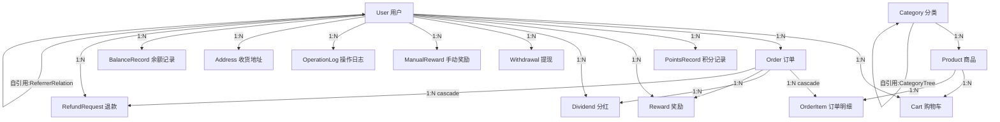

# 小京入职报告

> 生成时间：2026-06-20
> 模式：chat-only（GLM-5.1），资料由胡子哥分 4 段提供

---

## 任务 1：项目铁律复述报告（基于 AGENTS.md）

### 铁律 1：commit + push 成功 ≠ 部署完成

**复述**：终端显示 push 成功不代表远程仓库真的收到了代码。必须 push 之后立刻用 `git log origin/main --oneline -1` 查远程最新 commit，再和 Vercel Dashboard 上的部署 commit hash 对比，不一致就是 push 实际失败了，必须重推。

**防什么坑**：git push 静默失败——终端没有报错，但远程仓库没更新，Vercel 部署的还是旧代码。

**真实事故**：v6 版本，本地 commit `3f53bc4` 已存在，终端显示 push 成功，但 `git log origin/main` 还停在旧的 `d9a94d3`，Vercel 部署的是 v6 旧版，胡子哥看到页面毫无变化，排查 30 分钟才发现问题，重推后才解决。

---

### 铁律 2：UI 改动必须本地 dev server 真实截图

**复述**：改了前端代码，不能只看 build 通过就认定页面变了。必须启动 dev server、真实浏览器打开目标页面、登录后访问受保护页面、截图确认。如果 Playwright 被登录拦截跑不了，可以接受"源码级验证 + 胡子哥登录后截图"，但绝不能拿"build 成功"当"页面已变"。

**防什么坑**：build 通过 + push 成功，但实际部署的代码不完整或没更新，页面显示的还是旧版。

**真实事故**：v6 版本，猫爪改完代码说 build 和推送都成功了，但部署的是 v6 旧版（缺少 flex-wrap 和 stripHtmlTags），胡子哥看到页面没变化才暴露问题。

---

### 铁律 4：$queryRaw 错误链必须一次修到底

**复述**：`$queryRaw` / `$queryRawUnsafe` 的报错是链式暴露的，修一层 build 才露出下一层。不能修完表面错误就 push，必须反复 build 直到 0 错误。字段名以 `schema.prisma` 为准，不能靠猜。

**防什么坑**：逐层修、逐层推，每次部署都还是 500，反反复复浪费大量时间。

**真实事故**：v12 版本注册接口 500 错误，迭代了 5 轮——表名大小写、字段命名风格、类型转换、TS 类型定义、连锁类型错误，修一轮推一次，每推一次还是 500，前后花了 2 小时才彻底解决。

---

### 铁律 5：$queryRaw / $queryRawUnsafe 是最后手段

**复述**：Prisma 6 + Vercel + Supabase 环境下，`$queryRaw` 系列有未文档化的类型处理行为，即使本地 build 通过、逻辑正确，部署后仍可能报类型错误。默认禁止使用，原子操作用 `updateMany` + `where` 替代，递归查询用 `findMany` + 内存遍历替代 CTE。

**防什么坑**：绕过 ORM 写原始 SQL，看起来灵活，但在 Prisma 6 + 远程 PostgreSQL 环境下类型系统会出不可预测的问题，修了 A 报 B，无限循环。

**真实事故**：v17 版本，从 v0 到 v7 共 7 个版本、6 次失败推送、约 2 小时，最终彻底删除 `$queryRawUnsafe` 改用 Prisma 原生 ORM 才成功。根因有 6 层深：从表面 500 → SQL 报错 → 命名不匹配 → 类型系统冲突 → Prisma 6 模板字面量不是纯字符串替换 → 未文档化的类型处理行为。

---

### 铁律 6：支付/订单类派单必须走完整链路测试

**复述**：涉及支付、订单、支付密码、收货、库存扣减的改动，必须模拟完整 happy path，不能只看 build 0 错误 + 代码逻辑审阅。同类状态变更不能重复执行，`updateMany` 的条件是防并发而非幂等保护。

**防什么坑**：代码逻辑看起来对，但事务内状态变更顺序导致二次调用时条件已不满足，100% 失败却 build 通过。

**真实事故**：v43-4 版本，verify-payment 路由内事务先 `updateMany` 把订单状态改 paid，然后调 `payOrder`，`payOrder` 内部再次 `updateMany`（条件 `status=pending`），此时已无 pending 订单 → `count=0` → 抛异常"订单不存在或状态已变更"，导致 verify-payment 100% 失败的 P0 bug 流到用户面前。

---

### 项目级规则速览

| 规则 | 要点 |
|------|------|
| 富文本展示 | description 不能直接渲染，必须 `stripHtmlTags` + 截取 50 字 |
| 商品复制状态 | status 必须三元判断兜底，不能默认 active |
| 鉴权 | 重用 `verifyPermission` 工具 |
| 操作日志 | 用 `logOperation`，接受对象参数 |
| lucide-react 图标 | `Copy` 不存在，用 `ClipboardCopy` |
| Prisma Json 字段 | 有只读性，必须深拷贝 `JSON.parse(JSON.stringify())` |
| 操作列按钮排版 | `min-w-[300px]`、`whitespace-nowrap` 等 |

---

**自评：8/10**

**疑问点**：
1. 铁律编号跳过了 3，是被删除还是遗漏？
2. "Prisma Json 字段只读性"——这个深拷贝方案在性能敏感场景是否有更好的替代？
3. 协作角色中"mavis"和"猫爪"的具体工具/agent 对应关系是什么？

---

## 任务 2：Prisma 模型关系图报告（基于 schema.prisma）

### 一、模型清单（共 20 个）

| # | 模型 | 表名(@@map) | 用途 |
|---|------|-------------|------|
| 1 | User | users | 用户账号，含余额/积分/等级/推荐关系 |
| 2 | Product | products | 商品，含零售价/会员价/积分比例 |
| 3 | Category | categories | 商品分类，支持树形自引用 |
| 4 | Order | orders | 订单，含支付/物流/收货人信息 |
| 5 | OrderItem | order_items | 订单明细，关联商品和数量 |
| 6 | PointsRecord | points_records | 积分变动记录 |
| 7 | Reward | rewards | 推荐奖励/团队奖励 |
| 8 | Dividend | dividends | 分红池分红记录 |
| 9 | Withdrawal | withdrawals | 提现申请及审核 |
| 10 | SystemConfig | system_configs | 系统配置（站点/支付/SEO等） |
| 11 | LevelSnapshot | level_snapshots | 用户等级日快照 |
| 12 | PointsUnlockSchedule | points_unlock_schedules | 积分解锁计划（按天释放） |
| 13 | Cart | carts | 购物车条目 |
| 14 | ManualReward | manual_rewards | 管理员手动发放奖励 |
| 15 | OperationLog | operation_logs | 操作审计日志 |
| 16 | NotificationTemplate | notification_templates | 通知模板（按类型+渠道唯一） |
| 17 | RefundRequest | refund_requests | 退款申请 |
| 18 | Address | addresses | 收货地址（v43-5），含省市区 |
| 19 | BalanceRecord | balance_records | 余额变动记录（v43-6），含6种类型 |
| 20 | banners | banners | 轮播图，snake_case字段+行级安全 |

### 二、Mermaid 关系图

### 三、特别关注项

#### User 自引用关系
- **ParentRelation**: `parentId → id`，安置树（左/右位置），`position` 字段标识
- **ReferrerRelation**: `referrerId → id`，推荐关系，用于计算推荐奖
- 两者独立：推荐人 ≠ 安置父节点

#### Address（v43-5）
- 完整地址四段式：`province` + `city` + `district` + `detailAddress`
- `isDefault` 标记默认地址，有联合索引 `[userId, isDefault]`
- Order 的 `recipientName/recipientPhone/shippingAddress` 是下单时快照，不直接关联 Address 表

#### BalanceRecord（v43-6）
- `type` 枚举 6 种：payment / refund / reward / withdraw / unfreeze / admin_adjust
- `amount` 正负双向：正=入账，负=出账
- 同时记录变动后快照：`balance` + `frozenBalance`
- `sourceType + sourceId` 多态关联，可指向 Order/Reward/Withdrawal/ManualReward
- 无外键约束，靠 `sourceType` 区分来源

#### Order.paymentVerified
- v43-2 新增，`Boolean @default(false)`
- 标记支付密码验证是否通过，防止未验证就提交支付
- 配合 User.`paymentPasswordHash` 使用

#### @map() 规则
- 几乎所有字段都用 `@map` 映射为 snake_case（如 `passwordHash → password_hash`）
- 所有表名都用 `@@map` 映射为复数 snake_case（如 `User → users`）
- 唯一例外：`banners` 模型字段本身就是 snake_case，无 @map

#### banners 特殊性
- 字段名直接 snake_case（`image_url`、`link`、`alt`）
- `@id` 用 `@default(dbgenerated("gen_random_uuid()"))` 而非 `uuid()`
- 使用 `@db.Uuid` 和 `@db.Timestamptz(6)` PostgreSQL 专用类型
- 有行级安全（Row Level Security）标记，需额外迁移配置
- 与其他模型无关联，独立存在

### 四、自评与疑问点

**自评：9/10**

**疑问点**：
1. BalanceRecord.sourceType/sourceId 多态关联无约束，能否保证 sourceId 一定指向有效记录？
2. Order 收货信息 vs Address 表：Order 快照了收货信息但无 Address 外键，查询"该地址下的订单"无法实现
3. LevelSnapshot / PointsUnlockSchedule 无 userId 外键关联，只有字段未建 relation，是否应加上？
4. banners 行级安全注释提示需要额外迁移配置，目前是否已完成？
5. User 余额/积分字段与 BalanceRecord/PointsRecord 存在数据冗余，需确保事务一致性

---

## 任务 3：奖励系统核心方法报告（基于 reward.service.ts）

### 一、Export 方法清单

#### 1. `createReferralReward`
- **入参**: `orderId: string, orderAmount: number, referrerId: string, fromUserId: string`
- **出参**: `Promise<void>`
- **业务逻辑**: 计算直推奖金 = 订单金额 × `REWARD_RATES.REFERRAL`（10%）。在事务中创建一条 `type='referral'` 的 reward 记录（状态直接设为 `paid`），同时给推荐人余额增加对应金额。

#### 2. `createBrandBonusReward`
- **入参**: `orderId: string, orderAmount: number, referrerId: string, fromUserId: string`
- **出参**: `Promise<void>`
- **业务逻辑**: 先查推荐人等级，若低于 `DISTRIBUTOR`（经销商）则直接返回。否则计算品牌管理奖 = 订单金额 × `REWARD_RATES.BRAND_BONUS`，在事务中创建 `type='brand_bonus'` 的 reward 记录并增加推荐人余额。

#### 3. `createTeamRewards`（多级分销核心）
- **入参**: `orderId: string, orderAmount: number, buyerId: string`
- **出参**: `Promise<void>`
- **业务逻辑**: 从购买者出发，逐级向上遍历推荐链最多 3 级，收集每个推荐人的 id、等级、上级推荐人。遍历时用 `visitedIds` 防环。收集完毕后，在单一事务中按 `TEAM_REWARD_LEVELS` 配置（5%/3%/2%）逐级发放团队奖。只有等级 ≥ DISTRIBUTOR 的推荐人才能获得团队奖，低于此等级的跳过。

#### 4. `createDividendReward`（多级分销核心）
- **入参**: `orderId: string, orderAmount: number, buyerId: string`
- **出参**: `Promise<void>`
- **业务逻辑**: 从购买者出发向上遍历推荐链（最深 50 级，防环），收集所有等级 ≥ SUPERVISOR（主管）的上线用户。分红池 = 订单金额 × `REWARD_RATES.DIVIDEND`。按等级权重分配：SUPERVISOR=1, PRESIDENT=2, BOARD=3。每人的分红 = `分红池 × 个人权重 / 总权重`，金额保留 2 位小数。在事务中为每个符合条件的人创建 dividend 记录并增加余额。

#### 5. `processOrderRewards`（主入口）
- **入参**: `orderId: string`
- **出参**: `Promise<void>`
- **业务逻辑**: 查询订单及其用户、商品信息。仅当订单状态为 `paid` 时继续。然后按顺序调用：
  1. 有推荐人 → `createReferralReward`（直推奖）
  2. 有推荐人 → `createTeamRewards`（团队奖）
  3. 有推荐人 且 买家等级 ≥ DISTRIBUTOR 且 非升级商品 → `createBrandBonusReward`（品牌管理奖）
  4. 无条件 → `createDividendReward`（分红奖）
  5. → `checkUpgradeFromOrder`（升级检查）

  **注意**: 这些奖励创建是串行 await 的，非并行。

#### 6. `checkUpgradeFromOrder`
- **入参**: `userId: string, order: { items, payAmount }`
- **出参**: `Promise<void>`
- **业务逻辑**: 仅当订单含升级商品时执行。累计升级商品数量到用户，然后给买家推荐人增加直推业绩。接着检查买家和推荐人是否满足升级条件（委托 `UserService.checkAndUpgradeLevel`）。

#### 7. `getUserRewardStats`
- **入参**: `userId: string`
- **出参**: `Promise<{ totalAmount, referralTotal, brandBonusTotal, teamTotal, dividendTotal, totalCount }>`
- **业务逻辑**: 并行执行三个查询——reward 按 type 分组求和、dividend 聚合求和及计数、reward 总数。汇总直推/品牌管理/团队/分红四项金额及总条数返回。使用了 `groupBy` 和 `aggregate` 优化，避免逐条查询。

#### 8. `processRefund`
- **入参**: `orderId: string`
- **出参**: `Promise<void>`
- **业务逻辑**: 查出该订单所有 `status='paid'` 的 reward 记录和所有 dividend 记录。在事务中：逐条扣回用户余额（decrement），将 reward 状态改为 `refunded`，将 dividend 记录直接删除（非软删除）。

### 二、特别关注项

#### 多级分销奖励算法
- **团队奖**: 固定 3 级，比例由 `TEAM_REWARD_LEVELS` 配置（5%/3%/2%），等级门槛 DISTRIBUTOR
- **分红奖**: 动态深度（最多 50 级），等级门槛 SUPERVISOR，按等级权重加权分配池
- 两者都有防环机制（`visitedIds` Set）

#### 状态机
- Reward 状态仅有两个: `paid` → `refunded`（退款时转换）
- 创建时直接 `paid`，无 `pending`/`frozen` 等中间态
- Dividend 无状态字段，退款时直接 delete

#### `$queryRawUnsafe` 使用
- **未使用**。所有数据库操作均通过 Prisma ORM 标准方法（`create`/`update`/`findUnique`/`findMany`/`groupBy`/`aggregate`/`$transaction`），无原始 SQL 注入风险。

### 三、自评与疑问点

**自评：7/10**

**疑问点**：
1. `createTeamRewards` 中若中间某级不满足等级要求被 `continue`，该级配额是否应该顺延给下一级？当前实现是跳过但不补发。
2. `processRefund` 中 dividend 采用 delete 而非状态标记，历史审计追溯能力是否充足？
3. `processOrderRewards` 四个奖励方法串行执行，若中间某步失败，前面的奖励已入账，是否存在数据不一致风险？
4. 奖励创建时直接 `paid`，缺少审核/冻结期，退款时余额可能已不足扣回。

---

## 任务 4：最近 5 个 commit 报告（基于 git log）

### 一、5 个 commit 完整标题

| # | Hash | 时间 | 标题 |
|---|------|------|------|
| 1 | `bcc7cf3` | 2026-06-20 16:54 | feat: requestRefund 退余额 + balance_record（v43-6 Batch 4） |
| 2 | `118f789` | 2026-06-20 15:42 | feat: payOrder 事务原子扣余额 + balance_record（v43-6 Batch 3） |
| 3 | `5b0a207` | 2026-06-20 11:26 | feat: 余额扣减 + BalanceRecord 流水（v43-6） |
| 4 | `1e87b02` | 2026-06-20 01:57 | fix: CheckoutDialog 集成 AddressPicker 省市区三级联动（v43-5-修复-2） |
| 5 | `feb7908` | 2026-06-20 01:18 | fix: 商品详情页 CheckoutDialog 接入地址簿（v43-5-修复-1） |

### 二、一句话总结本周主线

本周（6 月 20 日当天）集中完成 **v43-5 收货地址簿集成**和 **v43-6 余额扣减 + BalanceRecord 流水记录**功能，核心是让下单支付链路具备完整的余额操作审计能力。

### 三、推测下一步

- **v43-7** 可能做提现 withdraw 侧的 BalanceRecord 流水对齐（目前 v43-6 只做了 payOrder 和 refund 的余额流水），以及管理员手动调账的 balance_record 记录，使所有余额变更入口都有流水覆盖。
- **v44** 可能开始做支付网关对接（目前 SystemConfig 里 `paymentProvider` 默认是 `"mock"`）。

### 四、自评与疑问点

**自评：8/10**

**疑问点**：
1. v43-6 Batch 1/Batch 2 去了哪里？commit log 只看到 Batch 3 和 Batch 4，前两个 batch 可能是未推送的本地 commit 或被 squash 合并。
2. v43-5 的主线 commit（地址簿功能本身）不在最近 5 条中，说明 v43-5 主体是 6 月 19 日完成的，今天只做了两个修复。
3. 所有 commit 都是 `feat`/`fix` 类型，没有 `test` 类型，测试覆盖率可能不足（`__tests__/` 下只有 3 个测试文件）。